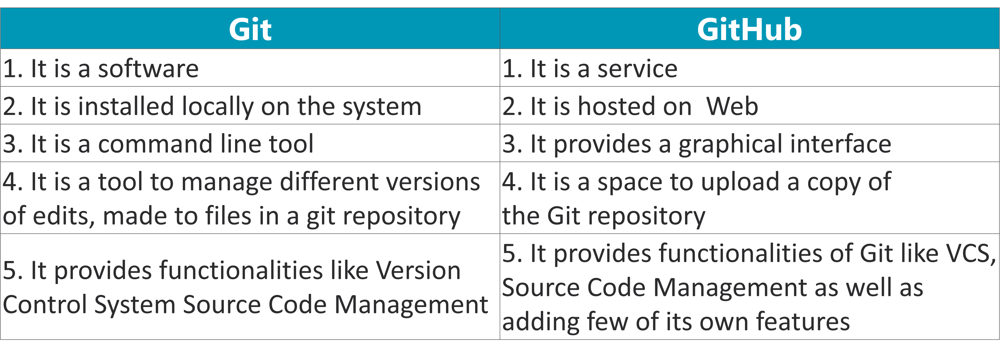

# Github101
All in one repo for your github problems!

# What's Github?

## Difference between git and github?





#### Adding some color
 `Hello`
 `#c5f015`
 `#1589F0`
 Normal Text
```
 `Hello`
 `#c5f015`
 `#1589F0`
 Normal Text

```


```diff
- text in red
- more text in red
+ text in green
! text in orange
# text in gray
@@ text in purple (and bold)@@
Some normal text in here!
```

```
```diff
- text in red
- more text in red
+ text in green
! text in orange
# text in gray
@@ text in purple (and bold)@@
Some normal text in here!
```

```


## Github Daily [Currenlty maintaining a working knowledge for work in separate server; NEEDS TO be updates ASAP!]

#### 1. Initialize a repo in a local directory and clone an existing repo to it:
```
a. git init
b. git clone <https link for the existing github repo>
c. Make your code changes
d. git add -A
e. git commit -m "This is my first commit"
f. git push --set-upstream origin master
<Note here: your default branch could be named  "master" or "main"; check git branch --list>

```


#### 2. Inspect and Compare:
```
git log
>>> show commits in the current branch history
git log branchB...branchA
>>> show commits that are in A and not in B, no space in b/w dots

```
#### 3. Branches:
```
git branch -l
>>> List all the branches in your repo
git checkout -b branch1
>>> Checkout/Create  a new branch branch1
git checkout master
>>> Switch to branch master


```
